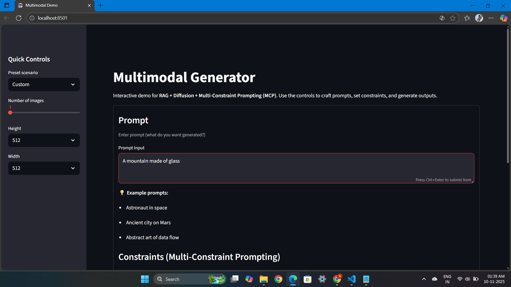
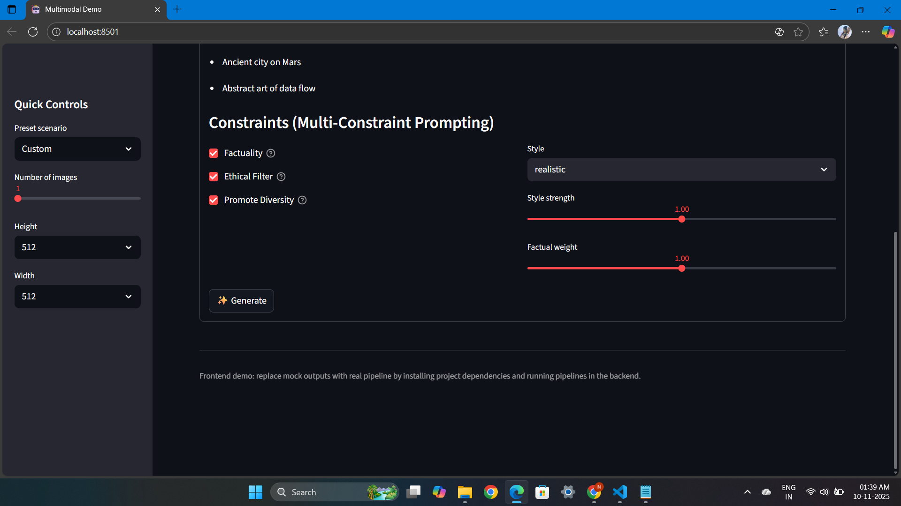
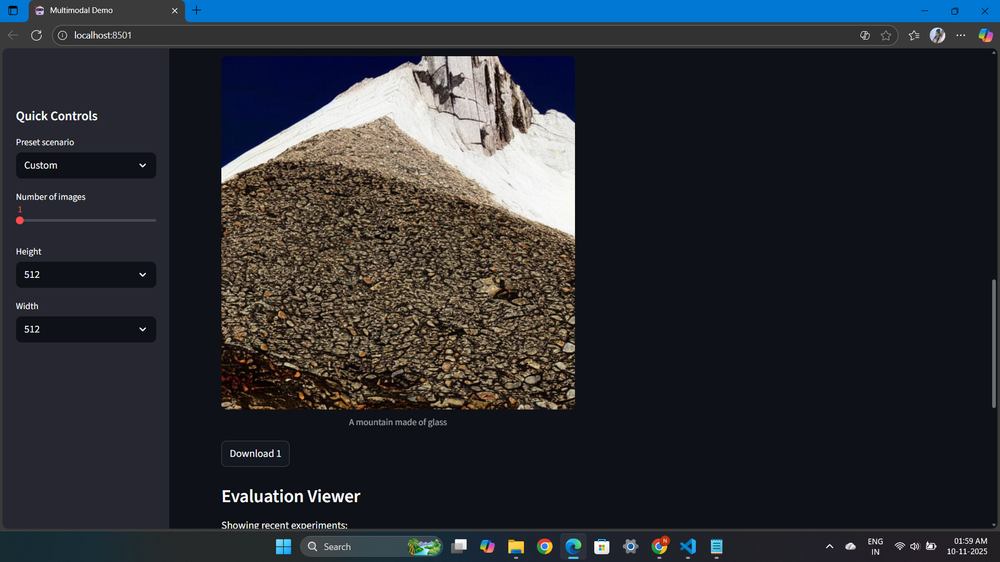
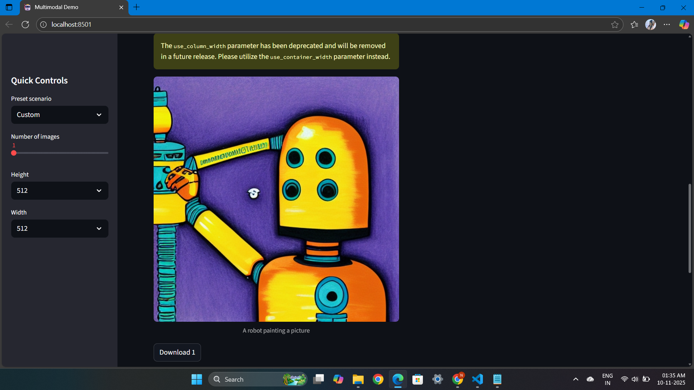

# Integrated Diffusion RAG MCP

**Integrating Diffusion Models with Retrieval-Augmented Generation and Multi-Constraint Prompting for Multimodal Content Generation**

---

## Overview

This project integrates **Diffusion Models**, **Retrieval-Augmented Generation (RAG)**, and **Multi-Constraint Prompting (MCP)** to build a unified multimodal content generation system.  
It combines *image generation, text retrieval, and adaptive constraint control* to generate coherent and high-quality visual and textual outputs.

---

## Key Features

- **Diffusion-based Image Generation** – Uses Stable Diffusion pipelines from the Hugging Face `diffusers` library.
- **Retrieval-Augmented Generation (RAG)** – Retrieves contextually relevant information using FAISS or Chroma vector databases.
- **Multi-Constraint Prompting (MCP)** – Dynamically adapts generation parameters based on user-defined constraints.
- **Text + Image Embeddings** – Powered by `transformers` and `sentence-transformers`.
- **Evaluation Metrics** – Includes FID, CLIPScore, and other visual/textual metrics.
- **Interactive UI** – Streamlit-based frontend for easy experimentation and visualization.

---
## Structure:
```bash
integrated_diffusion_rag_mcp/
│
├── README.md
├── requirements.txt
├── setup.py
├── .env
├── config.yaml                     # Global config (paths, model names, constraints, API keys)
│
├── data/
│   ├── raw/                          # Unprocessed datasets
│   ├── processed/                    # Tokenized, preprocessed datasets
│   ├── embeddings/                   # Vectorized data (CLIP/BERT)
│   ├── metadata/                     # Captions, annotations, indexes
│   ├── retrieval_index/              # FAISS / Chroma persistent stores
│   └── examples/                     # Example multimodal prompts for demos
│
├── models/
│   ├── __init__.py
│   │
│   ├── diffusion/
│   │   ├── base_diffusion.py         # Core diffusion pipeline (e.g., Stable Diffusion)
│   │   ├── controlnet_adapter.py     # Optional ControlNet support
│   │   ├── unet_config.py
│   │   └── diffusion_pipeline.py     # Combined RAG + Diffusion generation logic
│   │
│   ├── retrieval/
│   │   ├── embedder.py               # Embedding model (CLIP, BERT)
│   │   ├── retriever.py              # Dense / hybrid retriever
│   │   ├── index_builder.py          # Build FAISS/Chroma index
│   │   └── reranker.py               # Optional cross-encoder reranker
│   │
│   ├── constraints/
│   │   ├── constraint_manager.py     # Manages all constraints dynamically
│   │   ├── factuality_checker.py     # Checks knowledge-grounded correctness
│   │   ├── style_controller.py       # Controls tone, art style, etc.
│   │   ├── ethical_filter.py         # Filters NSFW or bias-prone outputs
│   │   └── diversity_controller.py   # Promotes visual/textual diversity
│   │
│   ├── fusion/
│   │   ├── multimodal_fuser.py       # Combines text+image representations
│   │   └── attention_bridge.py       # Optional transformer-based fusion
│   │
│   ├── multimodal_generator.py       # Central model integrating RAG + Diffusion + MCP
│   ├── prompt_constructor.py         # Dynamically builds multi-constraint prompts
│   └── evaluator.py                  # Evaluates multimodal outputs (BLEU, CLIPScore, FID, CSR)
│
├── pipelines/
│   ├── text_generation.py            # Text-only RAG + constraints → text
│   ├── image_generation.py           # RAG + diffusion + constraints → image
│   ├── multimodal_generation.py      # Unified multimodal generation
│   ├── evaluation_pipeline.py        # Runs evaluation metrics end-to-end
│   └── realworld_demo_pipeline.py    # For real-world scenario demos
│
├── training/
│   ├── dataset_loader.py             # Unified loader for text, image, multimodal data
│   ├── fine_tuning.py                # Fine-tuning CLIP / ControlNet
│   ├── loss_functions.py
│   ├── train_config.yaml
│   └── trainer.py                    # Handles model training loops
│
├── experiments/
│   ├── configs/
│   │   ├── ablation_rag.yaml         # Config for RAG-only test
│   │   ├── ablation_diffusion.yaml   # Config for Diffusion-only test
│   │   ├── full_model.yaml           # Config for full RAG+Diffusion+MCP
│   │   └── constraint_sweep.yaml     # Sweep over constraints weights
│   │
│   ├── results/
│   │   ├── metrics_logs.csv
│   │   ├── evaluation_plots/
│   │   └── comparison_tables/
│   │
│   ├── run_ablation.py               # Runs ablation studies automatically
│   └── run_experiments.py            # Master script for reproducible results
│
├── utils/
│   ├── config_loader.py
│   ├── logging_utils.py
│   ├── visualization.py              # Plots + Streamlit visualizations
│   ├── metrics.py                    # BLEU, FID, CLIPScore, CSR, etc.
│   ├── prompt_utils.py
│   ├── data_utils.py
│   └── timer.py
│
├── evaluation/
│   ├── metrics_reporter.py           # Generate tables, LaTeX, CSV outputs
│   ├── qualitative_examples.py       # Side-by-side visual comparisons
│   ├── human_eval.py                 # Human evaluation setup (optional)
│   └── evaluation_dashboard.py       # Streamlit dashboard for evaluation
│
├── frontend/
│   ├── app.py                        # Streamlit / Gradio front-end
│   ├── components/
│   │   ├── prompt_ui.py
│   │   ├── image_display.py
│   │   ├── constraint_controls.py
│   │   └── evaluation_viewer.py
│   └── static/
│       └── css/
│
├── notebooks/
│   ├── 01_data_exploration.ipynb
│   ├── 02_model_integration.ipynb
│   ├── 03_constraint_tuning.ipynb
│   ├── 04_demo_generation.ipynb
│   ├── 05_evaluation_visuals.ipynb
│   └── 06_realworld_case_study.ipynb
│
└── tests/
    ├── test_retrieval.py
    ├── test_diffusion_integration.py
    ├── test_constraints.py
    ├── test_evaluator.py
    ├── test_multimodal_pipeline.py
    └── test_end_to_end.py
```
----
## Screenshots:
### Interface:





### Output: 




---

## Installation

### 1️. Clone the repository
```bash
git clone https://github.com/KhotNoorin/integrated-diffusion-rag-mcp-ThesisCodeBase.git
cd integrated_diffusion_rag_mcp
```
### 2️. Create a virtual environment (recommended)
```bash
python -m venv .venv
.\.venv\Scripts\activate
```
### 3️. Install dependencies
If you want the latest compatible versions for Python 3.13+:
```bash
pip install -r requirements.txt
```
Or install the project in editable (development) mode:
```bash
pip install -e .
```
### Usage
Run the frontend app
```bash
streamlit run frontend/app.py
```
Or run as a Python module
```bash
python -m frontend.app
```
Once launched, you can:
- Enter a text prompt
- Adjust generation constraints (e.g., max tokens, creativity)
- Generate multimodal outputs (images + text)
- View evaluation results interactively

## Technologies Used
- Python 3.13
- PyTorch, Diffusers, Transformers
- FAISS, ChromaDB
- Streamlit / Gradio
- Pandas, NumPy, Matplotlib
- Torchmetrics, Scikit-image

## Developer Notes
- Works on Windows, macOS, and Linux
- Fully supports CPU and CUDA GPU acceleration
- Modular design – easily extendable with new RAG retrievers or diffusion backbones
- For Intel optimization, you can later add intel-extension-for-pytorch once Python 3.13 support is available

## Example Workflow
1. Provide a prompt (e.g., “A futuristic city skyline at sunset”)
2. Adjust MCP parameters in the sidebar:
    - Max token length
    - Creativity/temperature
    - Constraint weighting
3. The model:
    - Uses RAG to retrieve contextually related text or image embeddings
    - Applies MCP to enforce generation constraints
    - Feeds the processed prompt to the Diffusion Model for final generation
4. Outputs:
    - Generated image(s)
    - Textual summaries or captions
    - Evaluation metrics such as FID and CLIPScore

## Evaluation

You can evaluate generated samples using:

python -m evaluation.run_metrics

### Supported metrics:
- FID (Fréchet Inception Distance)
- CLIPScore
- Cosine Similarity
- Human Evaluation Reports (Excel via openpyxl)

---


## Acknowledgements

Built using:
- Hugging Face Diffusers
- Transformers
- FAISS
- Streamlit
----

## Author

Noorin Khot

GitHub: KhotNoorin

---
